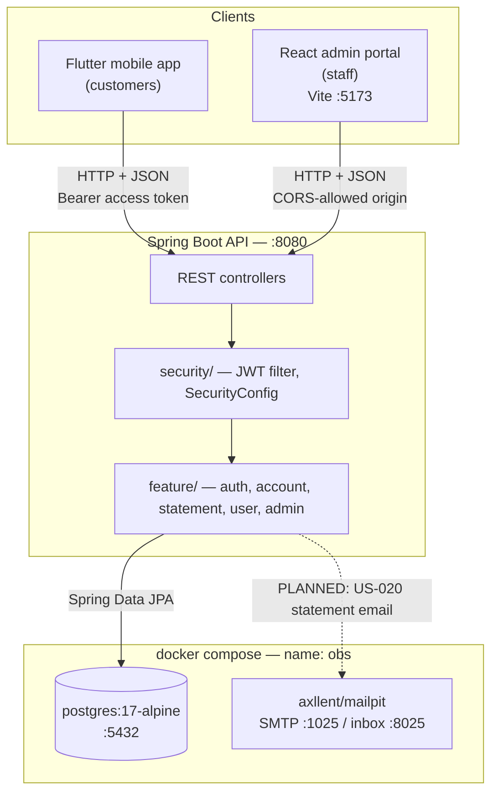
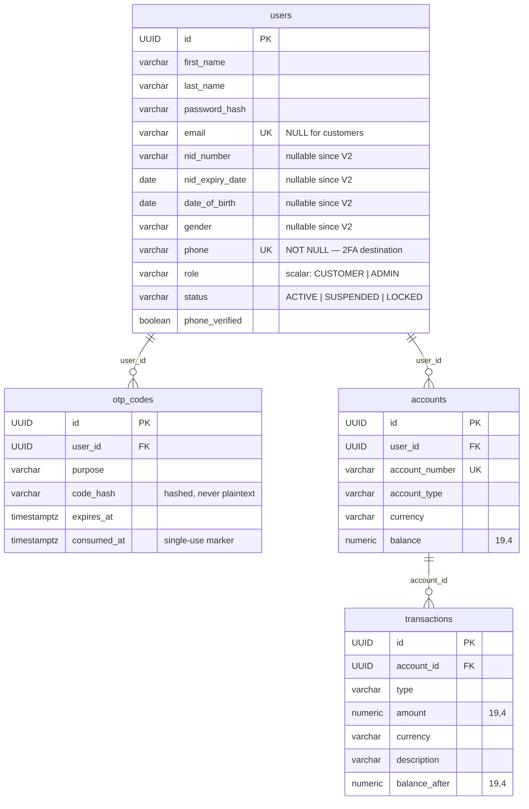

# Online Banking System — Architecture

Companion to [`sprint-plan.md`](./sprint-plan.md). That document says *what* gets built and *when*;
this one says *how the pieces fit* — and, in Part B, where the plan contradicts itself or leaves a
hole that will stop work when it is reached.

**Every section is marked BUILT or PLANNED.** Anything not marked BUILT does not exist in the repo
today (as of Sprint 3 in progress, post-resequencing). A doc that blurs the two is worse than no doc.

---

# Part A — The system as it stands

## A.1 Constraint that shapes everything

Local demo only. No deployment target, no cloud infrastructure, no production data, no real payment
rails. Every "external" system — SMS, interbank transfer, merchant settlement — is a stub or a
simulation behind an interface, so that swapping in a real provider later is a one-class change
rather than a redesign. This is a deliberate architectural position, not a shortcut, and it is what
makes a 58-story scope survivable for one person in 12 weeks.

## A.2 Topology — BUILT



| Component | Where | Port / address |
|---|---|---|
| Backend API | `backend/` | `localhost:8080` |
| Admin portal (dev server) | `web-admin/` | `localhost:5173` |
| Postgres | `docker-compose.yml` | `localhost:5432`, db/user/pass all `obs` |
| Mailpit SMTP / inbox | `docker-compose.yml` | `1025` / `localhost:8025` |
| Mobile → backend | `mobile/lib/core/api/api_client.dart` | `localhost:8080`, or `10.0.2.2:8080` on the Android emulator; override with `--dart-define=API_BASE_URL=…` |

The backend is the single source of truth. Neither client holds business logic — the Flutter app and
the React portal are both view layers over the same REST API, and neither talks to Postgres.

## A.3 Backend package layout — BUILT

Feature-first under `backend/src/main/java/com/obs/backend/`, exactly as CLAUDE.md prescribes: each
`feature/<name>/` contains `controller/ service/ service/impl/ repository/ entity/ dto/ mapper/`,
plus a local `exception/` where the feature has its own error types.

| Package | Status | Contents |
|---|---|---|
| `feature/auth` | BUILT | Registration, OTP, login, 2FA, refresh. `OtpSender` + `LoggingSmsSender`. |
| `feature/account` | BUILT | Accounts, balances, transactions, filters. |
| `feature/statement` | BUILT | `PdfStatementRenderer` (PDFBox), `StatementService`. |
| `feature/user` | BUILT | `User` entity + repository (shared, no controller of its own). |
| `common/` | BUILT | `PageResponse`, `ValidationErrorResponse`, `GlobalExceptionHandler`. |
| `config/` | BUILT | `OpenApiConfig` — springdoc, Swagger UI at `/swagger-ui.html`. |
| `security/` | BUILT | `Role`, `AccountStatus`, `AccountStatusPolicy`, `CurrentUserProvider`, `SecurityConfig`, `jwt/`. |
| `feature/admin` | BUILT (partial) | Staff-facing customer read APIs: `GET /admin/customers`, `/{id}`, `/{id}/accounts` (US-054, US-049), class-level `@PreAuthorize("hasRole('ADMIN')")`. US-047's staff/role endpoints and US-048's status mutation are still PLANNED. |
| `feature/transfer` | PLANNED | Sprint 4 (US-025 – US-035). Needs a `transfers` table + `transactions.transfer_id` as a prerequisite — see **H1**. |
| `feature/beneficiary` | PLANNED | Sprint 4 backend, Sprint 5 mobile (US-029 – US-031). |
| `feature/billpayment` | PLANNED | Sprint 5 (US-038 – US-042). |
| `feature/card` | PLANNED | Sprint 5 (US-043 – US-045). |
| `feature/notification` | PLANNED | Sprint 3 (US-022) — nothing exists yet; see hole **H12**. |
| `feature/audit` | PLANNED | Sprint 6 (US-055). |

Java 21, Spring Boot (webmvc, Data JPA, Security, Validation), Flyway, JJWT, PDFBox, springdoc.

## A.4 Data model — BUILT (V1–V5)



Two deliberate decisions worth recording:

- **Identity is split by role.** Customers are identified by `phone` (KYC collects no email, US-007);
  admins by `email` (US-010). `email` is `UNIQUE` but nullable, and is `NULL` on every customer row.
  Both roles carry a `phone`, because 2FA is SMS for everyone.
- **V2 relaxes the KYC columns to nullable** so the bootstrap admin row (seeded from
  `ADMIN_BOOTSTRAP_*` env vars via Flyway placeholders, never hardcoded) does not need placeholder
  ID-document data. This is why `nid_number` et al. are `NOT NULL` in V1 and nullable afterwards.
- **Money is `NUMERIC(19,4)`** everywhere, mapped to `BigDecimal`. No floats touch a balance.

## A.5 Authentication — BUILT, and the best-specified part of the system

Three token types, all HMAC-SHA signed with one key (`JWT_SECRET`), all carrying a `type` claim that
is checked on *every* resolve — a refresh token presented as a bearer credential is rejected, not
merely unauthorized later.

| Token | TTL (default) | Claims | Issued by | Redeemed at |
|---|---|---|---|---|
| `CHALLENGE` | 5 min | `sub` | `POST /auth/login` | `POST /auth/2fa/verify` |
| `ACCESS` | 15 min | `sub`, `roles[]` | `/auth/2fa/verify`, `/auth/refresh` | `Authorization: Bearer` |
| `REFRESH` | 7 days | `sub` | `POST /auth/2fa/verify` | `POST /auth/refresh` |

**2FA is mandatory for both roles.** `POST /auth/login` never returns real tokens — it validates
credentials, checks `AccountStatusPolicy.checkLoginAllowed(status)`, and returns only a challenge
token. There is no per-user opt-out.

```mermaid
sequenceDiagram
    participant C as Client (Flutter / React)
    participant A as /auth/*
    participant O as OtpService + OtpSender
    participant DB as Postgres

    C->>A: POST /auth/login (phone|email + password)
    A->>DB: find user, verify bcrypt hash
    A->>A: AccountStatusPolicy.checkLoginAllowed(status)
    A->>O: issue OTP (hashed, stored in otp_codes)
    O-->>O: LoggingSmsSender → backend log (dev stub)
    A-->>C: 200 { challengeToken }  ← no access token

    C->>A: POST /auth/2fa/verify (challengeToken + code)
    A->>DB: match code_hash, check expires_at / consumed_at
    A->>DB: mark consumed_at
    A-->>C: 200 { accessToken, refreshToken }

    C->>A: POST /auth/refresh (refreshToken)
    A->>A: type must be REFRESH; re-check account status
    A-->>C: 200 { accessToken }
```

Route protection lives in `SecurityConfig`: stateless sessions, CSRF disabled (no cookies — tokens
are sent as headers), CORS restricted to `WEB_ADMIN_ORIGIN`, and `JwtAuthenticationFilter` placed
before `UsernamePasswordAuthenticationFilter`. Unauthenticated by design: the seven `/auth/*` POSTs,
the springdoc routes, and `/error` (without which every `@Valid` failure returns an opaque 403
instead of a 400).

`/auth/refresh` re-loads the user and re-runs the status policy, so a suspended account loses access
within one access-token lifetime (≤15 min) rather than surviving the 7-day refresh window. That is a
better property than most designs at this stage get, and it is worth not regressing.

**OTP delivery is a stub by design.** `OtpSender` is a one-method interface; `LoggingSmsSender`
(`@Profile("dev")`) writes the code to the backend log. US-060 swaps in a real provider behind the
same interface. Codes are stored hashed with an `expires_at` and a `consumed_at` single-use marker.

## A.6 Client session handling — BUILT

The two clients made *different* choices, and both are currently under-documented in the plan.

**React admin (`features/auth/auth-context.tsx`)** — persists the **refresh token + user profile
only**, in `sessionStorage`, and exchanges it for a fresh access token on load via `/auth/refresh`.
The access token is never persisted. `sessionStorage` (not `localStorage`) means the session dies
with the tab. This is a reasonable local-demo posture; it is still XSS-reachable, and the plan should
say so rather than leave it implied.

**Flutter mobile (`core/api/api_client.dart`)** — holds the access token **in memory** on the
`ApiClient` instance. `pubspec.yaml` has no `flutter_secure_storage` and no persistence layer, so
closing the app logs the customer out and the refresh token is effectively unused on mobile. See
hole **H11**.

Both clients normalize backend errors into a `{ error, message, fieldErrors }` shape produced by
`GlobalExceptionHandler` and the per-feature exception handlers.

## A.7 Frontend architecture — BUILT

**React admin** — React 19 + TypeScript (strict) + Vite 8, React Router 8, TanStack Query,
react-hook-form + Zod, Tailwind 4 with shadcn/Radix primitives in `components/ui/`, Sonner for
toasts, oxlint, Vitest + Testing Library. Feature-first under `src/features/` (`auth/`, `shell/`)
with `ProtectedRoute` gating the shell.

**Flutter mobile** — feature-first under `lib/features/<name>/{data,presentation}`, `lib/core/`
holding the API client and theme. `http` for networking, `printing` for the PDF statement viewer.
No business logic in widgets, per CLAUDE.md.

## A.8 CI and testing — BUILT

Three path-filtered workflows (`backend-ci.yml`, `web-admin-ci.yml`, `mobile-ci.yml`), each
triggering only on changes inside its own directory — which is why PRs are kept to one stack.
Backend tests mirror the main tree (`feature/auth/controller`, `feature/account/controller`,
`feature/statement/controller`, `security/jwt`) and run against the same `postgres:17-alpine`
that `docker-compose.yml` starts locally. Unit tests are written per-story throughout; Sprint 6 adds
*integration* testing on top, not testing-from-zero.

---

# Part B — Plot holes, and how to fill them

Ordered by **when they stop work**, not by severity. Each has a concrete fix sized for a solo
12-week build.

> **Status.** Every hole below has been actioned at the documentation layer — `sprint-plan.md`,
> `CLAUDE.md` and `docker-compose.yml` now carry the decisions and acceptance criteria. Several
> additionally need an implementation that belongs to a future sprint and has deliberately *not*
> been written ahead of schedule; those are now specified in the story that owns them. **The summary
> table at the end of Part B gives the current status of all sixteen.**

First, credit where it is due: `sprint-plan.md`'s **"Still to be written"** section already catches
four real gaps — the US-034 merchant QR spec, the shared notifications architecture, the SMS vendor
choice, and the US-020 email-address problem. Those are not repeated below. Everything that follows
is *in addition* to them.

## B.1 Blockers for Sprint 4 — settle these before writing US-025

### H1 · There is no transfer entity. A transfer is two orphaned rows.

`transactions` is a per-account ledger row with a `balance_after`, an `account_id`, and nothing else.
A transfer between two accounts is inherently **two** rows that must be created atomically and must
be recoverable as one event. There is no `transfer_id`, no counterparty column, no `transfers` table,
and no status field anywhere.

This breaks three stories that all assume a transfer is a first-class thing: **US-028** (confirmation
& receipt — a receipt for *what* row?), **US-050** (transfer monitoring feed — a feed of half-rows),
and **US-053** (today's transfer count & volume — counting `transactions` double-counts every
transfer).

**Fix.** Add before US-025 starts (Sprint 4, post-resequencing):

```sql
-- V6__create_transfers_table.sql
CREATE TABLE transfers (
    id              UUID PRIMARY KEY,
    from_account_id UUID NOT NULL REFERENCES accounts(id),
    to_account_id   UUID REFERENCES accounts(id),   -- NULL for simulated interbank (US-026)
    external_ref    VARCHAR(100),                    -- counterparty for US-026 / US-034
    amount          NUMERIC(19,4) NOT NULL,
    currency        VARCHAR(3) NOT NULL,
    status          VARCHAR(20) NOT NULL,            -- PENDING | COMPLETED | REJECTED
    reference       VARCHAR(100) NOT NULL UNIQUE,    -- receipt number, US-028
    created_at      TIMESTAMPTZ NOT NULL DEFAULT now()
);
ALTER TABLE transactions ADD COLUMN transfer_id UUID REFERENCES transfers(id);
```

One `@Transactional` method in `feature/transfer` writes the transfer row plus both legs. US-050 and
US-053 then read `transfers`, not `transactions`.

### H2 · `accounts.balance` has no optimistic locking. Money can be created.

`Account` has no `@Version` field and there is no `SELECT … FOR UPDATE` anywhere. Two concurrent
debits on the same account will read the same balance and both write their own result — a classic
lost update. In a *banking* capstone, a demo that can be made to duplicate money is the single worst
finding an assessor can hand you.

**Fix.** Cheapest correct option, ~20 minutes:

```java
@Version
@Column(nullable = false)
private long version;
```

plus `ALTER TABLE accounts ADD COLUMN version BIGINT NOT NULL DEFAULT 0;` and a retry-or-409 on
`OptimisticLockingFailureException`. Add "concurrent debit does not overdraw" as an explicit
acceptance criterion on **US-027**, with a test that fires two transfers at once.

### H3 · Multi-currency (US-016) exists in the schema with no FX model behind it.

`accounts.currency` and `transactions.currency` are both present and US-016 is "multi-currency
support" — but there is no rate table, no conversion service, and no rule anywhere. So: what happens
when US-025 transfers between the user's own USD and KHR accounts? And what currency is US-053's
"today's transfer volume" KPI summed in?

**Fix — take the cheap branch.** Do **not** build an FX engine in a 12-week solo project. Write into
US-027's acceptance criteria: *"cross-currency transfers are rejected with 400 `CURRENCY_MISMATCH`;
a customer moves money between same-currency accounts only."* Then pin US-053's KPI to a single
declared display currency and say which. Multi-currency stays a *display* feature (US-016 shows
per-currency balances) rather than a *conversion* feature. One paragraph of AC closes this.

## B.2 Blockers for Sprint 3 (the admin portal)

### H4 · US-053's "failed-login count" KPI has no data source until *after* the screen ships.

The KPI home screen is now Sprint 3. Nothing in the system records a failed login today, and the story
that captures critical actions (**US-055**, audit logs) is **Sprint 6**. The screen that displays the
number is built a full sprint before anything produces it.

**Fix.** Pick one: (a) add a `login_attempts` table in Sprint 3 alongside the KPI screen — it is also
the natural home for US-058's lockout counter, so the work is not wasted; or (b) cut the failed-login
tile from US-053's AC and add it to US-056's screen in Sprint 6, where the audit data actually
exists. Option (a) is better because US-058 needs the counter regardless.

### H5 · US-047 / US-048 / US-052 are tagged `[React]` only, but need backend that no story creates.

Their siblings (US-049, US-050, US-053, US-054) all carry `[BE]`. These three do not — yet:

- **US-047** is "role list, permission checkboxes per role, assign role to staff user." `users.role`
  is a single `VARCHAR(20)` scalar. There are no `roles`, `permissions`, or `role_permissions`
  tables, and no story creates them. There is also no admin-provisions-staff endpoint.
- **US-048** (suspend / lock / reactivate) needs a status-mutation endpoint. `AccountStatusPolicy`
  reads status; nothing writes it.
- **US-052** (bill provider CRUD) needs CRUD endpoints; US-038 only seeds data.

**Fix.** Add `[BE]` to all three, and **narrow US-047** to what the schema supports: assigning one of
the existing `Role` values to a staff user, plus creating staff accounts. A full RBAC
permission-matrix is a sprint of work by itself and is not in the 58-story budget. State the
narrowing in the story explicitly so it does not silently expand during Sprint 3.

*Related, worth a note not a fix:* `JwtService.generateAccessToken` takes a `Set<Role>` and emits a
`roles[]` array claim, while `User.role` is scalar and the call site is always `Set.of(user.getRole())`.
The token format already anticipates multi-role. That is fine as forward-compatibility — just don't
let it be mistaken for evidence that multi-role is supported.

## B.3 Security holes the plan under-specifies

### H6 · No OTP attempt counter. The 2FA code is brute-forceable.

`otp_codes` has `expires_at` and `consumed_at` but **no attempts column**, and `OtpServiceImpl`
contains no attempt/limit logic. A 6-digit code with a 5-minute window and unlimited guesses is
1,000,000 tries against a live challenge. US-058 is framed as endpoint rate limiting, which is
necessary but not the same control — and this needs a *schema* change US-058 never mentions.

**Fix.** `ALTER TABLE otp_codes ADD COLUMN attempts INT NOT NULL DEFAULT 0;` — increment on each
failed verify, hard-fail and consume the row at 5. Add to **US-059**'s acceptance criteria, and note
the migration so it isn't discovered on the last week.

### H7 · Challenge tokens are replayable for their full 5-minute TTL.

`resolveChallengeSubject` verifies signature and expiry only. There is no `jti`, no consumption
record, nothing marking a challenge as spent. Combined with **H6**, a single successful
username/password gives an attacker a 5-minute unlimited-guess window against the second factor —
which means 2FA-as-mandatory is weaker in practice than the plan claims.

**Fix.** Bind the challenge to the OTP row: put a `jti` in the challenge token, store it on the
`otp_codes` row, and invalidate both together on success or on attempt-limit. Home: **US-059**,
alongside H6 — they are one afternoon's work done together and two separate reworks done apart.

### H8 · US-058's endpoint list misses the two most attackable endpoints.

The plan names six routes to rate-limit: `/auth/login`, `/auth/otp/verify`, `/auth/otp/resend`,
`/auth/forgot-password`, `/auth/register`, `/auth/refresh`.

`SecurityConfig` also permits unauthenticated **`/auth/2fa/verify`** and **`/auth/2fa/resend`** —
precisely the two endpoints that consume a 6-digit code.

**Fix.** One-line amendment to US-058's AC to add both. Frame it as a correction to the existing
story, not a new one.

### H9 · No logout, no revocation.

There is no `/auth/logout` in `SecurityConfig`'s route list, refresh tokens are stateless JWTs with
no `jti` and no server-side store, and nothing can invalidate an issued token.

Severity is **moderate, not critical**, because `/auth/refresh` re-checks account status — so an
admin suspending a user (US-048) does cut them off within ≤15 minutes rather than 7 days. But: a
customer who changes their password (US-036) does not invalidate a stolen refresh token, and
"log out" on either client can only forget the token locally, not revoke it.

**Fix.** A `revoked_tokens(jti, user_id, revoked_at)` table checked in `/auth/refresh`, plus a
`POST /auth/logout` that writes to it. Add as an AC on **US-036** (password change must revoke) and
**US-059**. Small table, small filter, closes the whole class.

## B.4 Contradictions inside the plan itself

### H10 · `sprint-plan-review.md` does not exist.

Line 10 of `sprint-plan.md` says Rev 2 was "rebalanced after the review in `sprint-plan-review.md`,
which records the six decisions behind this version… **Read it before changing anything structural
here.**" Line 24 defers the feature-count question to the same file. `docs/` contains only
`git-workflow.md`, `sprint-plan.md`, and three todolists.

The plan's cited authority-of-record — the document you are instructed to consult before any
structural change — is missing. Every rationale it holds is currently unrecoverable.

**Fix.** Either write it (even a short version: the six decisions, one paragraph each) or strip both
references and fold the reasoning inline. Do not leave a pointer to nothing in a document that tells
future-you to obey it.

### H11 · Mobile has no session persistence, and Sprint 4 assumes it does.

Covered architecturally in A.6: `ApiClient.accessToken` is in-memory and `pubspec.yaml` has no
secure-storage dependency. The customer is logged out every time the app closes — while US-036
(change password) and US-037 (forgot password) in Sprint 4 are written as if a durable session
exists, and the refresh token the backend issues has nowhere to live on mobile.

**Fix.** Add `flutter_secure_storage` and a persistence AC to a Sprint 2 story (US-024's dashboard is
the natural home, since it is the first screen that must survive an app restart). Store the refresh
token only, mirroring the React choice; re-exchange on launch.

### H12 · The `NotificationService` is a Sprint 2 dependency with no owner and no schema.

The plan correctly notes US-022 "should define a single `NotificationService` with pluggable
channels" and lists the architecture note as still-to-be-written. What it does not say is that
**four** stories hang off it (US-023, US-035, US-060, plus US-022 itself), there is no
`feature/notification` package, no `notifications` table, and no push infrastructure decision (FCM?
local-only?) — which for a local demo with no Firebase project is a real question, not a detail.

**Fix.** Decide the push channel *before* Sprint 2 planning, and write it into the already-planned
architecture note. For a local demo, the honest answer is likely a `notifications` table plus
in-app polling, with FCM listed as the US-060-shaped swap behind the same interface — the same
pattern `OtpSender` already establishes. Reuse the shape that already works.

### H13 · Structural rule 1 used terminology that matched nothing in the document. — RESOLVED

The rule said US-005, US-006 and US-038 were each split into an `a` half and a `b` half, but no
`US-005b` or `US-006b` appears anywhere, and US-038 appears once.

The rule turned out to be describing a **real** structure with the wrong vocabulary: the "halves"
already exist under their own distinct story IDs, and the plan names the pairings elsewhere in its
own notes — Sprint 1's "Deliberately *not* in Sprint 1" already defers US-047/US-048, and US-038's
note already points at US-052.

| Backend model | Ships | Admin screen | Ships |
|---|---|---|---|
| US-005 Role model | Sprint 1 | US-047 Roles & permissions screen | Sprint 3 |
| US-006 Account status model | Sprint 1 | US-048 Suspend / lock / reactivate | Sprint 3 |
| US-038 Bill provider model & seed | Sprint 5 | US-052 Bill provider CRUD screen | Sprint 5 |

**Fixed** by rewriting rule 1 around those three pairs. No stories were missing and **no story counts
needed re-deriving** — the totals already counted both IDs.

### H14 · Structural rule 2 includes a story the Scope section says was removed.

Line 40 names **US-051** as one of the dashboard stories collapsed into the Sprint 5 build pass.
Line 18 lists "admin broadcast announcements (US-051)" among the removals. Both are in the same
document, ~20 lines apart.

**Fix.** Strike US-051 from rule 2. One-word edit; it currently makes the plan look unproofread in
the section that argues for its own rigor.

### H15 · `docker-compose.yml`'s header is stale, and US-020 has no mail config at all.

The compose file says "the backend sends OTP and statement emails to it over SMTP" — the OTP half is
false since the SMS decision, and `application.properties` contains **no `spring.mail.*` at all**, so
US-020 currently has neither a mail configuration nor (per the plan's own open question) a customer
email address to send to.

**Fix, in two parts.** The compose comment is unambiguously wrong and is **fixed now** — OTP does not
use email, and the header now says Mailpit exists solely for US-020.

The mail configuration is **deliberately not added**, because doing so would presume the answer to
the plan's own open question. If the email-address decision lands on "collect it separately,"
`spring.mail.*` becomes a US-020 acceptance criterion; if it lands on "drop email delivery," US-020
is cut and Mailpit leaves `docker-compose.yml` with it. Configuring mail before that choice is
building ahead of an unmade decision — the same discipline being applied to H1 and H2.

### H16 · CLAUDE.md contradicts itself on the frontend language.

Its Tech Stack table says the admin portal is "React, JavaScript"; its Conventions section says
"TypeScript strict mode"; the repo is `.tsx` with `typescript ~6.0.2` and a `tsc -b` build step.

**Fix.** One-line correction to the table. Small, but CLAUDE.md is the file that steers every future
session — a wrong row there propagates.

---

## Summary — current status of all sixteen

**Closed outright — nothing further to do:**

| Hole | What changed |
|---|---|
| H5 | US-047 / US-048 / US-052 now tagged `[BE]`; US-047 narrowed to single-role assignment, with the reasoning recorded in Sprint 5's notes |
| H8 | `/auth/2fa/verify` and `/auth/2fa/resend` added to US-058's endpoint list |
| H10 | Both pointers to the missing `sprint-plan-review.md` removed; the surviving open item (re-deriving the feature count) kept as an open item |
| H13 | Rule 1 rewritten around the three real story pairs; no counts needed re-deriving |
| H14 | US-051 struck from rule 2 |
| H16 | `CLAUDE.md`'s Tech Stack table now reads "React, TypeScript (strict), Vite" |
| H15 *(part)* | `docker-compose.yml`'s header corrected — Mailpit is for US-020 statement email only, never OTP |

**Specified and scheduled, implementation deliberately not written ahead of its sprint:**

| Hole | Now owned by | Work when that story starts |
|---|---|---|
| H1 | Prerequisite to US-025 · Sprint 4 | `transfers` table + `transactions.transfer_id`, one `@Transactional` writer |
| H2 | US-027 AC · Sprint 4 | `@Version` on `Account` + migration + concurrent-debit test |
| H3 | US-027 AC · Sprint 4 | Reject cross-currency with `400 CURRENCY_MISMATCH` (decision made, not deferred) |
| H4 | Sprint 3 (table + KPI screen ship together) | `login_attempts` table, serving both the KPI and US-058's lockout counter |
| H6 | US-059 · Sprint 6 | `otp_codes.attempts` column, hard-fail at 5 |
| H7 | US-059 · Sprint 6 | `jti` on the challenge token, consumed with the OTP row |
| H9 | US-059 + US-036 · Sprints 5/6 | `revoked_tokens` table, `POST /auth/logout`, revoke-on-password-change |
| H11 | US-024 AC · Sprint 2 | `flutter_secure_storage`, persist refresh token only, re-exchange on launch |

**Blocked on a decision only the project owner can make — both block Sprint 2 planning:**

| Hole | The choice |
|---|---|
| H12 | Push channel for US-022. Recommended default: a `notifications` table + in-app polling, with FCM as a later swap behind the same interface — the shape `OtpSender` already proves. |
| H15 *(part)* | US-020's email-address source. "Collect separately" → configure `spring.mail.*`; "drop email delivery" → cut US-020 and remove Mailpit from compose. |

The three that genuinely change the shape of the code remain **H1**, **H2** and **H12** — a transfer
entity, optimistic locking, and the notification channel. Each is cheap now and expensive in six
weeks. Everything else is acceptance criteria that are now written down, plus one afternoon of auth
hardening in US-059.
